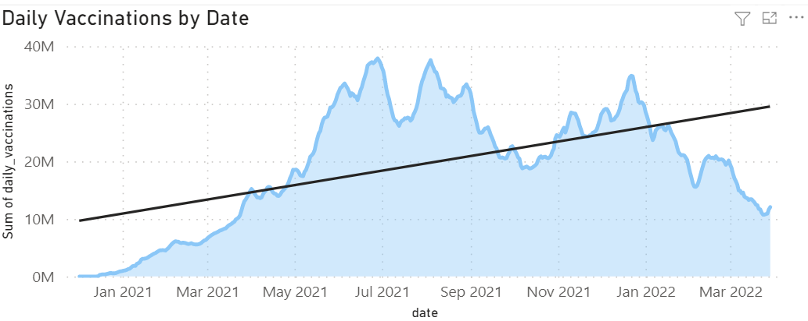
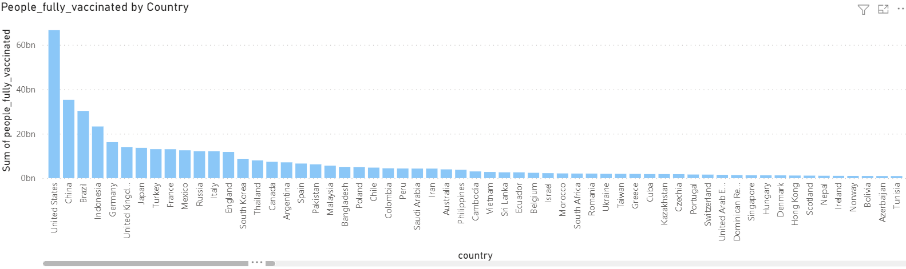

# COVID-19 Vaccinations Trend Analysis

Power BI project exploring global COVID-19 vaccination trends across countries during the 2021–2022 analysis period.

## Project Overview

This project uses Power BI to explore country-level COVID-19 vaccination data and visualize vaccination progress, daily trends, coverage measures, and vaccination data sources.

The analysis focuses on understanding differences in vaccination activity across countries and over time.

## Objectives

The project investigates:

- people vaccinated and fully vaccinated
- total vaccination activity
- vaccination measures per hundred
- daily vaccinations
- daily vaccinations per million
- country-level vaccination patterns
- vaccination data sources

## Tools & Skills

- Power BI
- Data Cleaning
- Data Transformation
- Data Visualization
- Exploratory Data Analysis
- Dashboard Development
- Time-Series Analysis

## Analysis Workflow

1. Imported the country vaccination dataset into Power BI Desktop.
2. Cleaned and preprocessed the data.
3. Created charts, cards, tables, and other visualizations.
4. Examined vaccination trends over time and across countries.
5. Summarized observations and recommendations.

## Selected Results

### Daily Vaccination Trend



The project examined changes in daily vaccination activity throughout the 2021–2022 analysis period.

### Country-Level Vaccination Analysis



The original Power BI analysis also compared vaccination measures across countries.

## Repository Structure

```text
COVID-19-Vaccinations-Trend-Analysis/
├── README.md
├── data/
│   ├── README.md
│   └── country_vaccinations.csv
├── powerbi/
│   ├── README.md
│   └── covid19_vaccination_trend_analysis.pbix
├── images/
│   ├── README.md
│   ├── covid_daily_vaccination_trend.png
│   └── covid_fully_vaccinated_by_country.png
└── docs/
    └── covid19_vaccination_trend_analysis_report.pdf
```

## Data & Analysis Limitations

This repository preserves the methodology of the original project while documenting important analytical limitations.

The original preprocessing workflow replaced some null values with zero. Missing observations do not necessarily represent true zero values, so this treatment can influence aggregations.

Some original country-level visuals use `Sum` aggregation on cumulative vaccination fields. These values should therefore not be interpreted as latest-date vaccination totals.

The exact original dataset URL and redistribution license are **Not confirmed from the uploaded files.**

## Documentation

The original project report is available in:

`docs/covid19_vaccination_trend_analysis_report.pdf`

The editable Power BI project is available in:

`powerbi/covid19_vaccination_trend_analysis.pbix`
